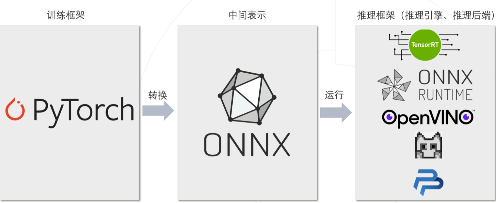
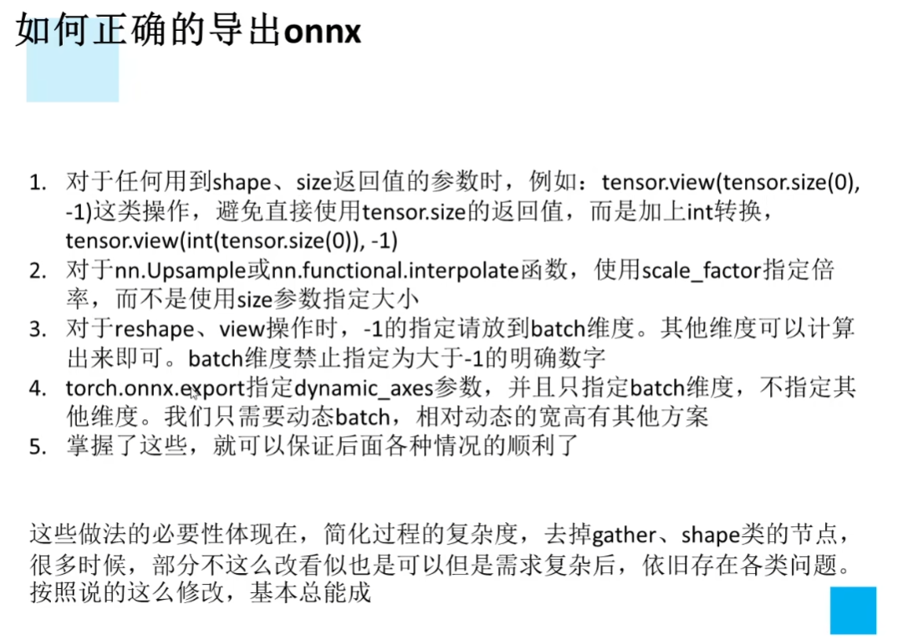

[TOC]

# 【Pytorch模型导入与导出】



## 一、导出为onnx模型



```python
import torch
from torchvision import models

# 有 GPU 就用 GPU，没有就用 CPU
device = torch.device('cuda:0' if torch.cuda.is_available() else 'cpu')

# 待导出模型
model = models.resnet18(pretrained=True)
model = model.eval().to(device)

# 构造输入Tensor
x = torch.randn(1, 3, 256, 256).to(device)

# 导出模型
with torch.no_grad():
    torch.onnx.export(
        model,                       # 要转换的模型
        x,                           # 模型的任意一组输入
        'resnet18_imagenet.onnx',    # 导出的 ONNX 文件名
        opset_version=11,            # ONNX 算子集版本
        input_names=['input'],       # 输入 Tensor 的名称（自己起名字）
        output_names=['output']      # 输出 Tensor 的名称（自己起名字）
    ) 
```

## 二、导入onnx模型

```python
import onnx

# 读取 ONNX 模型
onnx_model = onnx.load('resnet18_imagenet.onnx')

# 检查模型格式是否正确
onnx.checker.check_model(onnx_model)
print('无报错, onnx模型载入成功')

# 以可读的形式打印计算图
print(onnx.helper.printable_graph(onnx_model.graph))
```

## 三、使用Netron可视化模型结构

Netron：https://netron.app